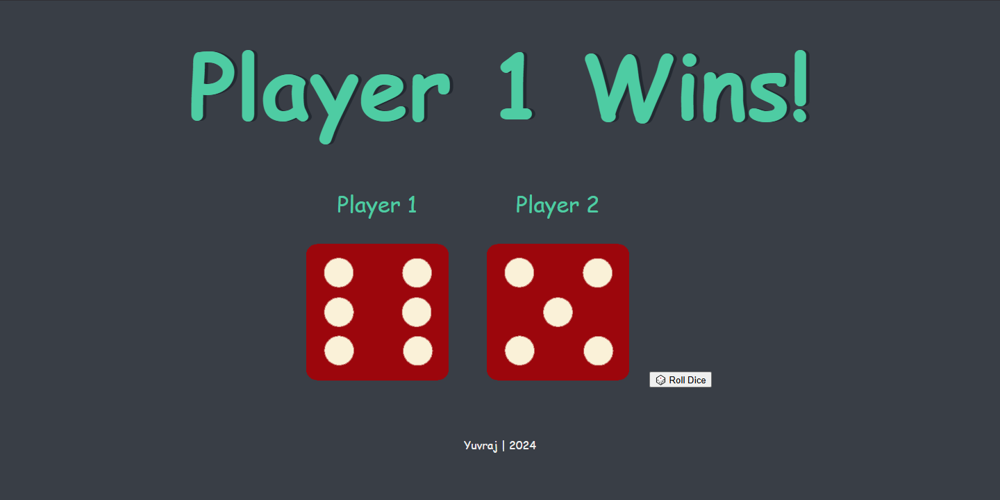
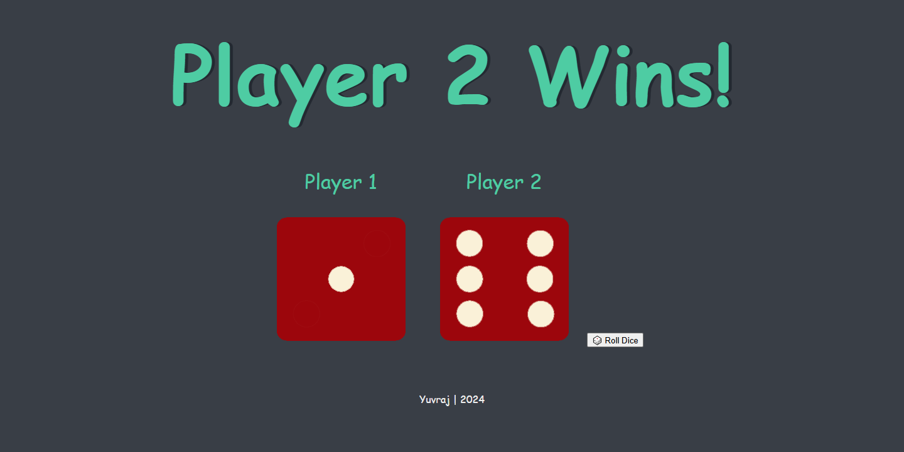
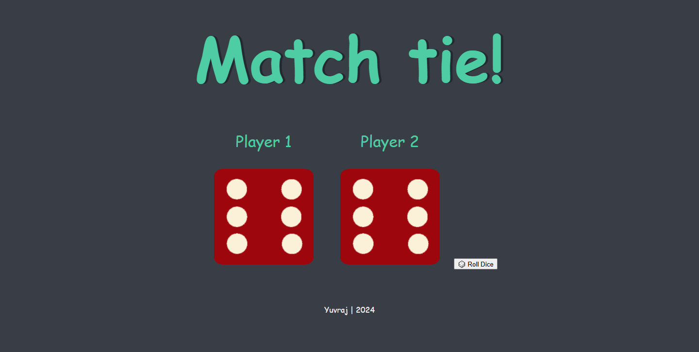

# 🎲 Dice Roll Game

A fun and simple two-player dice game built with HTML, CSS, and JavaScript. Press the **space bar** or tap the **Roll Dice** button to roll the dice and see who wins!

## 🚀 Demo

👉 [Live Demo on GitHub Pages](https://yuvraj1129.github.io/dice-roll-game/)

## 🛠️ Features

- Roll dice with a button click or spacebar
- Randomized dice outcomes
- Real-time winner announcement
- Mobile & desktop support

## 📸 Screenshots

 

## 🧠 Technologies Used

- HTML5
- CSS3
- JavaScript

## 📁 Folder Structure

dice-roll-game/
│
├── index.html # Main HTML
├── style.css # Stylesheet
├── Dice.js # Game Logic
└── images/ # Dice images

## 📦 Installation

1. Clone this repository:
   git clone https://github.com/yuvraj1129/dice-roll-game.git

2. Open `index.html` in your browser.

## ✨ Author

**Yuvraj Sharma**  
Feel free to connect on [LinkedIn](https://www.linkedin.com/in/yuvthetechie22) or share feedback!

---

Enjoy the game and let me know who wins more 😉
